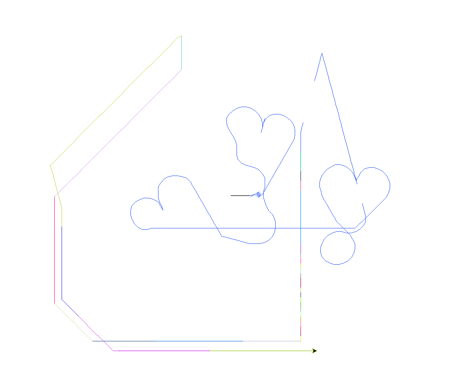
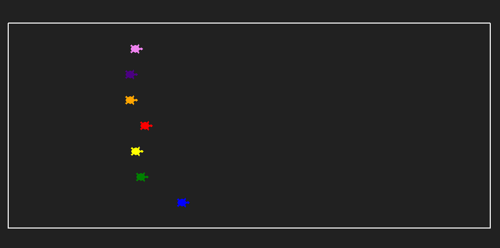
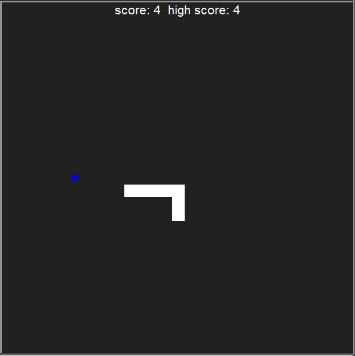
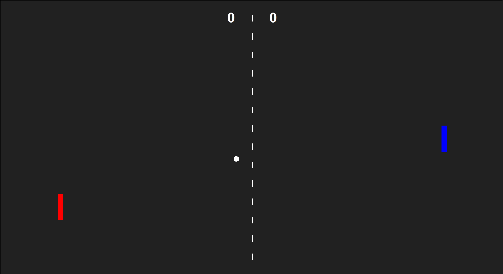
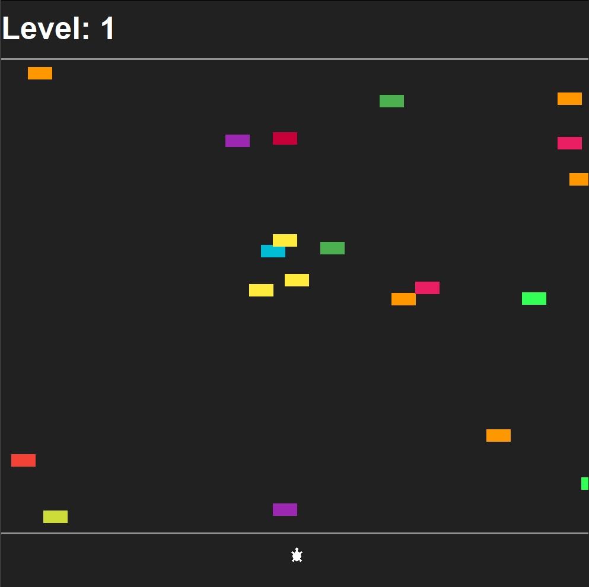
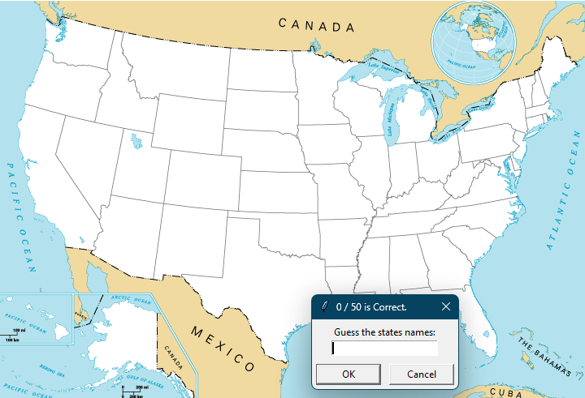
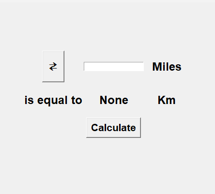

# 🗂️ Bunch of Small Projects

This repository contains a collection of small Python projects and games I’ve built while learning and experimenting.  
Each project is simple, fun, and great for practicing coding concepts.

---

## 📸 Project Previews

### 🎨 Etch-a-Sketch

---

### 🐢 Turtle Race

---

### 🐍 Snake Game

---

### 🏓 Pong Game

---

### 🚦 Turtle Crossing Game

---

### 🇺🇸 US States Guessing Game

---

### 📏 Miles to KM Converter

---

### Flash Card

---

### Kanye Quotes

---
